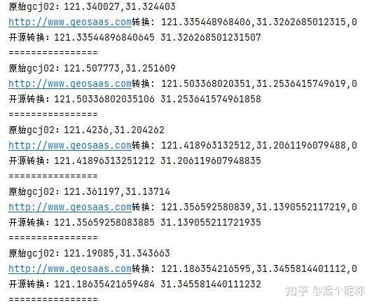

## [一、坐标系]()

### 1.1 分类

坐标系分为两种

1. 地理坐标系（Geographic Coordinate System, GCS）
2. 投影坐标系（Projected Coordinate System, PCS）

这边[知乎老哥](https://zhuanlan.zhihu.com/p/62864791)的文章描述很容易理解，我直接cv过来。

地理坐标系，就是一个球，说成球面坐标系反而好理解一点。就比如一个完整的橘子。


投影坐标系，就是将球展开后的一个面。就比如橘子剥皮展开。


地理坐标系和投影坐标系的最大区分，就是单位不同。

地理坐标系以**度**为单位。

投影坐标系以**米**为单位。

### 1.2 常用坐标系

对于地图开发人员来说，常见的测量系统就是WGS84测量系统(1984年全球测量系统)。

基于WGS84的常用坐标系为两种。

- [EPSG:4326](https://link.zhihu.com/?target=https%3A//epsg.io/4326)（WGS84公认的默认坐标系）
- [EPSG:3857](https://link.zhihu.com/?target=https%3A//epsg.io/3857)

4326是地理坐标系，以度为单位。广泛用于GPS定位等。

3857是投影坐标系，以米为单位。用于平面地图，如[GoogleMap](https://link.zhihu.com/?target=https%3A//www.google.com/maps/)、[OpenStreetMap](https://link.zhihu.com/?target=https%3A//www.openstreetmap.org/)、[BingMap](https://link.zhihu.com/?target=https%3A//www.bing.com/maps)等。

如果想要找取专属于自己地区、更精确的坐标系。可以去[http://epsg.io](https://link.zhihu.com/?target=http%3A//epsg.io)搜索。

## 二、geotools

作为用java做饭碗的人来说，想要研究Gis，肯定少不了跟geotools打交道。

### 2.1 maven依赖

pom.xml

```xml
<repositories>
    <repository>
        <id>osgeo</id>
        <name>OSGeo Release Repository</name>
        <url>https://repo.osgeo.org/repository/release/</url>
        <snapshots>
            <enabled>false</enabled>
        </snapshots>
        <releases>
            <enabled>true</enabled>
        </releases>
    </repository>
</repositories>

<dependencies>
    <dependency>
        <groupId>org.geotools</groupId>
        <artifactId>gt-grid</artifactId>
        <version>${geotools.version}</version>
    </dependency>
    <dependency>
        <groupId>org.geotools</groupId>
        <artifactId>gt-opengis</artifactId>
        <version>${geotools.version}</version>
    </dependency>


    <dependency>
        <groupId>org.geotools</groupId>
        <artifactId>gt-epsg-hsql</artifactId>
        <version>${geotools.version}</version>
        <exclusions>
            <exclusion>
                <groupId>javax</groupId>
                <artifactId>javaee-api</artifactId>
            </exclusion>
        </exclusions>
    </dependency>
    <dependency>
        <groupId>org.geotools</groupId>
        <artifactId>gt-main</artifactId>
        <version>${geotools.version}</version>
        <exclusions>
            <exclusion>
                <groupId>javax</groupId>
                <artifactId>javaee-api</artifactId>
            </exclusion>
        </exclusions>
    </dependency>

    <dependency>
        <groupId>org.geotools</groupId>
        <artifactId>gt-geojson</artifactId>
        <version>${geotools.version}</version>
        <exclusions>
            <exclusion>
                <groupId>javax</groupId>
                <artifactId>javaee-api</artifactId>
            </exclusion>
        </exclusions>
    </dependency>

    <dependency>
        <groupId>junit</groupId>
        <artifactId>junit</artifactId>
        <version>4.12</version>
        <scope>test</scope>
    </dependency>
</dependencies>
```

### 2.2 简单使用

下面简单演示一些常见用法。我这边就全以wkt为例了。wkt的绘制可以参考[wkt在线绘制展示_EPSG4326](https://link.zhihu.com/?target=https%3A//meethigher.top/wkt/)。

```java
/**
 * GeoTools简单使用
 *
 * @author chenchuancheng github.com/meethigher
 * @since 2022/5/22 20:30
 */
public class GeotoolsUsing {

    @Test
    public void testCreateGeo() throws Exception {
        //这是4326坐标系的wkt
        String wkt = "LINESTRING(110.26968650499015 35.774090269456565,118.2156404214427 35.973104738241815)";
        WKTReader reader = new WKTReader();
        Geometry geometry = reader.read(wkt);
        System.out.println(geometry.buffer(1));
        Assert.assertNotNull(geometry);
    }

    @Test
    public void testGeoApi() throws Exception {
        //area1是包含area2的
        String area1 = "POLYGON((113.36572265625 38.80204526520603,107.28369301557538 33.994384090476174,112.38134926557541 28.960087983961387,119.2368153333664 31.690781121452815,113.36572265625 38.80204526520603))";
        String area2 = "LINESTRING(110.35095139165554 33.90070434182671,116.21651043156132 33.564288629604945)";
        WKTReader reader = new WKTReader();
        Geometry geometry1 = reader.read(area1);
        Geometry geometry2 = reader.read(area2);

        System.out.println(geometry1.contains(geometry2));//true

        //获取边界，即获取最北、最南、最东、最西，组成一个矩形
        Geometry envelope = geometry1.getEnvelope();
        System.out.println(envelope.toString());//输出wkt

        //获取边界的点
        Envelope internal = geometry1.getEnvelopeInternal();
        double minX = internal.getMinX();
        double minY = internal.getMinY();

        //返回其中一个顶点
        Coordinate coordinate = geometry1.getCoordinate();
        System.out.println(coordinate);

        //拓宽区域，由于使用的是4326坐标系，1在此处表示1度。这个单位也是跟着坐标系走的
        //以面的边向外拓宽1，顶点处就是以1为半径的圆弧。如果是线，就是四周拓宽
        Geometry buffer = geometry1.buffer(1);
        System.out.println(buffer);

        //判断交叉，我画的是个不相交，但包含的。
        //这个方法有两个含义。a.相交 b. 包含 满足其一即可
        boolean intersects = geometry1.intersects(geometry2);
        System.out.println(intersects);//true

        //面求面积，线求长度。单位同样是跟着坐标系走
        System.out.println(geometry1.getArea());
        System.out.println(geometry2.getLength());
    }


    @Test
    public void testTransformCrs() throws Exception {
        //我使用的wkt都是经度在前，一般正常使用也是经度在前。将4326转换为3857计算面积(㎡)
        CRSAuthorityFactory factory = CRS.getAuthorityFactory(true);
        CoordinateReferenceSystem source = factory.createCoordinateReferenceSystem("EPSG:4326");
        CoordinateReferenceSystem target = factory.createCoordinateReferenceSystem("EPSG:3857");
        MathTransform transform = CRS.findMathTransform(source, target);

        //高德地图面积https://developer.amap.com/demo/javascript-api/example/calcutation/ring-area
        // 该区域高德面积125178908819平方米，坐标系不同，有误差很正常
        String wkt = "POLYGON((110.4141583943802 36.03154311769477,110.54418331527785 33.09352034423874,114.95057594167424 33.32318635566811,114.73386810758919 35.99648515314789,110.4141583943802 36.03154311769477))";

        WKTReader reader = new WKTReader();
        Geometry geometry = reader.read(wkt);
        System.out.println(geometry.getArea());//度为单位，12.258110818164612
        Geometry geometry1 = JTS.transform(geometry, transform);
        //用bigdecimal只是单纯不想看到科学计数法。
        System.out.println(BigDecimal.valueOf(geometry1.getArea()));//米为单位，184591949648.2439
    }
}
```

## 三、常用坐标系转换

### 3.1 java工具类

抄袭自[JAVA实现WGS84、百度坐标系、高德坐标系转化工具类_liuccn的博客-CSDN博客_java百度坐标转高德坐标](https://link.zhihu.com/?target=https%3A//blog.csdn.net/lc_2014c/article/details/125878730)

进行修改后如下

```java
/**
 * 仅适用于中国的点位坐标系转换
 * 各地图API坐标系统比较与转换;
 * <p>
 * WGS84坐标系：即地球坐标系，国际上通用的坐标系。设备一般包含GPS芯片或者北斗芯片获取的经纬度为WGS84地理坐标系,
 * 谷歌地图采用的是WGS84地理坐标系（中国范围除外）;
 * <p>
 * GCJ02坐标系：即火星坐标系，是由中国国家测绘局制订的地理信息系统的坐标系统。由WGS84坐标系经加密后的坐标系。
 * 高德地图、腾讯地图、谷歌中国地图和搜搜中国地图采用的是GCJ02地理坐标系;
 * <p>
 * BD09坐标系：即百度坐标系，GCJ02坐标系经加密后的坐标系;
 * <p>
 * 搜狗坐标系、图吧坐标系等，估计也是在GCJ02基础上加密而成的。
 *
 * @author https://blog.csdn.net/lc_2014c/article/details/125878730
 * @copyer chenchuancheng
 * @since 2023/1/6 16:13
 */
public class PointConvert {

    //private final static double pi = 3.1415926535897932384626;
    private final static double pi = Math.PI;
    private final static double a = 6378245.0;
    private final static double ee = 0.00669342162296594323;

    /**
     * 是否超出中国范围以外
     *
     * @param lat 纬度
     * @param lon 经度
     * @return true表示中国外
     */
    private static boolean outOfChina(double lat, double lon) {
        if (lon < 72.004 || lon > 137.8347)
            return true;
        return lat < 0.8293 || lat > 55.8271;
    }


    /**
     * 转换纬度
     *
     * @param x
     * @param y
     * @return
     */
    private static double transformLat(double x, double y) {
        double ret = -100.0 + 2.0 * x + 3.0 * y + 0.2 * y * y + 0.1 * x * y
                + 0.2 * Math.sqrt(Math.abs(x));
        ret += (20.0 * Math.sin(6.0 * x * pi) + 20.0 * Math.sin(2.0 * x * pi)) * 2.0 / 3.0;
        ret += (20.0 * Math.sin(y * pi) + 40.0 * Math.sin(y / 3.0 * pi)) * 2.0 / 3.0;
        ret += (160.0 * Math.sin(y / 12.0 * pi) + 320 * Math.sin(y * pi / 30.0)) * 2.0 / 3.0;
        return ret;
    }

    /**
     * 转换经度
     *
     * @param x
     * @param y
     * @return
     */
    private static double transformLon(double x, double y) {
        double ret = 300.0 + x + 2.0 * y + 0.1 * x * x + 0.1 * x * y + 0.1
                * Math.sqrt(Math.abs(x));
        ret += (20.0 * Math.sin(6.0 * x * pi) + 20.0 * Math.sin(2.0 * x * pi)) * 2.0 / 3.0;
        ret += (20.0 * Math.sin(x * pi) + 40.0 * Math.sin(x / 3.0 * pi)) * 2.0 / 3.0;
        ret += (150.0 * Math.sin(x / 12.0 * pi) + 300.0 * Math.sin(x / 30.0
                * pi)) * 2.0 / 3.0;
        return ret;
    }

    /**
     * 84 to 火星坐标系 (GCJ-02)
     * <p>
     * World Geodetic System ==> Mars Geodetic System
     *
     * @param lat
     * @param lon
     * @return
     */
    public static Point wgs84_to_gcj02(double lat, double lon) {
        if (outOfChina(lat, lon)) {
            return null;
        }
        double dLat = transformLat(lon - 105.0, lat - 35.0);
        double dLon = transformLon(lon - 105.0, lat - 35.0);
        double radLat = lat / 180.0 * pi;
        double magic = Math.sin(radLat);
        magic = 1 - ee * magic * magic;
        double sqrtMagic = Math.sqrt(magic);
        dLat = (dLat * 180.0) / ((a * (1 - ee)) / (magic * sqrtMagic) * pi);
        dLon = (dLon * 180.0) / (a / sqrtMagic * Math.cos(radLat) * pi);
        double mgLat = lat + dLat;
        double mgLon = lon + dLon;

        return new Point(mgLat, mgLon);
    }

    /**
     * 转换为84坐标系
     *
     * @param lat
     * @param lon
     * @return
     */
    private static Point transform(double lat, double lon) {
        if (outOfChina(lat, lon)) {
            return new Point(lat, lon);
        }
        double dLat = transformLat(lon - 105.0, lat - 35.0);
        double dLon = transformLon(lon - 105.0, lat - 35.0);
        double radLat = lat / 180.0 * pi;
        double magic = Math.sin(radLat);
        magic = 1 - ee * magic * magic;
        double sqrtMagic = Math.sqrt(magic);
        dLat = (dLat * 180.0) / ((a * (1 - ee)) / (magic * sqrtMagic) * pi);
        dLon = (dLon * 180.0) / (a / sqrtMagic * Math.cos(radLat) * pi);
        double mgLat = lat + dLat;
        double mgLon = lon + dLon;

        return new Point(mgLat, mgLon);
    }

    /**
     * 火星坐标系 (GCJ-02) to 84
     *
     * @param lon
     * @param lat
     * @return
     */
    public static Point gcj02_to_wgs84(double lat, double lon) {
        Point gps = transform(lat, lon);
        double longitude = lon * 2 - gps.getLon();
        double latitude = lat * 2 - gps.getLat();
        return new Point(latitude, longitude);
    }


    /**
     * 火星坐标系 (GCJ-02) 与百度坐标系 (BD-09) 的转换算法
     * <p>
     * 将 GCJ-02 坐标转换成 BD-09 坐标
     *
     * @param gg_lat
     * @param gg_lon
     */
    public static Point gcj02_to_bd09(double gg_lat, double gg_lon) {
        double x = gg_lon, y = gg_lat;

        double z = Math.sqrt(x * x + y * y) + 0.00002 * Math.sin(y * pi);

        double theta = Math.atan2(y, x) + 0.000003 * Math.cos(x * pi);

        double bd_lon = z * Math.cos(theta) + 0.0065;

        double bd_lat = z * Math.sin(theta) + 0.006;

        return new Point(bd_lat, bd_lon);
    }

    /**
     * 火星坐标系 (GCJ-02) 与百度坐标系 (BD-09) 的转换算法
     * <p>
     * 将 BD-09 坐标转换成GCJ-02 坐标
     *
     * @param bd_lat
     * @param bd_lon
     * @return
     */
    public static Point bd09_to_gcj02(double bd_lat, double bd_lon) {
        double x = bd_lon - 0.0065, y = bd_lat - 0.006;
        double z = Math.sqrt(x * x + y * y) - 0.00002 * Math.sin(y * pi);

        double theta = Math.atan2(y, x) - 0.000003 * Math.cos(x * pi);

        double gg_lon = z * Math.cos(theta);

        double gg_lat = z * Math.sin(theta);

        return new Point(gg_lat, gg_lon);
    }


    /**
     * 点位信息
     *
     * @author chenchuancheng
     * @since 2023/1/6 16:14
     */
    public final static class Point {

        /**
         * 经度
         */
        private double lon;

        /**
         * 纬度
         */
        private double lat;

        public Point(double lat, double lon) {
            this.lon = lon;
            this.lat = lat;
        }

        public double getLon() {
            return lon;
        }

        public void setLon(double lon) {
            this.lon = lon;
        }

        public double getLat() {
            return lat;
        }

        public void setLat(double lat) {
            this.lat = lat;
        }
    }
}
```

以火星坐标系GCJ02转换WGS84为例，准确性如下。





### 3.2 postgis方法

抄袭自[geocompass/pg-coordtransform: 基于PostgreSQL+PostGIS的火星坐标系、百度坐标系、WGS84坐标系、CGCS2000坐标系的转换函数](https://link.zhihu.com/?target=https%3A//github.com/geocompass/pg-coordtransform)

开启postgis扩展

```sql
create extension postgis
```

创建方法

```sql
CREATE OR REPLACE FUNCTION "public"."geoc_bd09towgs84_multipolygon"("source_geom" "public"."geometry")
  RETURNS "public"."geometry" AS $BODY$
DECLARE
    target_parts    geometry[];
    single_polygon  geometry;
    single_polygon_trans  geometry;
    final_geom      geometry;

BEGIN
    IF ST_GeometryType(source_geom) != 'ST_MultiPolygon' THEN
        RETURN null;
    END IF;
    FOR single_polygon IN SELECT (ST_Dump($1)).geom LOOP
        single_polygon_trans := geoc_bd09towgs84_polygon(single_polygon); 
        target_parts := array_append(target_parts,single_polygon_trans);
    END LOOP;

    SELECT st_multi(ST_Union(target_parts)) INTO final_geom;
    RETURN final_geom;
END;
$BODY$
  LANGUAGE plpgsql VOLATILE
  COST 100;
CREATE OR REPLACE FUNCTION "public"."geoc_bd09towgs84_point"("geom" "public"."geometry")
  RETURNS "public"."geometry" AS $BODY$
DECLARE
  x       numeric; 
    y       numeric; 
    gcj_point  geometry;
    wgs_point  geometry;

BEGIN
    if st_geometrytype(geom) != 'ST_Point' then
      return null;
    end if;
    x := st_x(geom);
    y := st_y(geom);
    if (geoc_is_in_china_bbox(x, y) = false) then
      return geom;
    end if;
    gcj_point = geoc_bd09togcj02_point(geom);
      wgs_point = geoc_gcj02towgs84_point(gcj_point);
      return wgs_point;

END;
$BODY$
  LANGUAGE plpgsql VOLATILE
  COST 100;
CREATE OR REPLACE FUNCTION "public"."geoc_bd09towgs84_polygon"("source_geom" "public"."geometry")
  RETURNS "public"."geometry" AS $BODY$
DECLARE
    target_parts    geometry[];
    source_npoints  integer;
    single_line     geometry;
    single_line_trans geometry;
    single_polygon  geometry;
    final_geom      geometry;

BEGIN
    IF ST_GeometryType(source_geom) != 'ST_Polygon' THEN
        RETURN null;
    END IF;

    FOR single_polygon IN SELECT ST_ExteriorRing ((st_dumprings($1)).geom) as geom LOOP             
        source_npoints := ST_NPoints(single_polygon); 
        single_line  := ST_RemovePoint(single_polygon, source_npoints - 1);  
        single_line_trans := geoc_bd09towgs84_line(single_line);  
        target_parts := array_append(target_parts, ST_AddPoint(single_line_trans, ST_PointN(single_line_trans, 1)));  
    END LOOP;
    SELECT ST_MakePolygon(target_parts[1], target_parts[2:array_upper(target_parts, 1)]) INTO final_geom; 
    RETURN final_geom;

END;
$BODY$
  LANGUAGE plpgsql VOLATILE
  COST 100;
CREATE OR REPLACE FUNCTION "public"."geoc_cgcs2000tobd09"("geom" "public"."geometry")
  RETURNS "public"."geometry" AS $BODY$
DECLARE
BEGIN
IF st_srid(geom) != '4490' THEN
        RETURN null;
end if;
return geoc_wgs84tobd09(st_transform(st_setsrid(geom,4490),4326));
END;
$BODY$
  LANGUAGE plpgsql VOLATILE
  COST 100;
CREATE OR REPLACE FUNCTION "public"."geoc_cgcs2000togcj02"("geom" "public"."geometry")
  RETURNS "public"."geometry" AS $BODY$
DECLARE
BEGIN
IF st_srid(geom) != '4490' THEN
        RETURN null;
end if;
return geoc_wgs84togcj02(st_transform(st_setsrid(geom,4490),4326));
END;
$BODY$
  LANGUAGE plpgsql VOLATILE
  COST 100;
CREATE OR REPLACE FUNCTION "public"."geoc_delta"("lon" numeric, "lat" numeric)
  RETURNS "pg_catalog"."jsonb" AS $BODY$
DECLARE
    ret             varchar;
    dLon            numeric;
    dlat            numeric;
    radLat          numeric;
    magic           numeric;
    sqrtMagic       numeric;
    ee              numeric;
    a               numeric;
BEGIN
    ee := 0.006693421622965823;
    a  := 6378245;
    dLon := geoc_transform_lon(lon - 105, lat - 35);
    dLat := geoc_transform_lat(lon - 105, lat - 35);
    radLat := lat / 180 * pi();
    magic = sin(radLat);

    magic = 1 - ee * magic * magic;

    sqrtMagic := sqrt(magic);
    dLon = (dLon * 180) / (a / sqrtMagic * cos(radLat) * pi());
    dLat = (dLat * 180) / ((a * (1 - ee)) / (magic * sqrtMagic) * pi());
    ret :='['||dLon||','||dLat||']';
    return ret::jsonb;
END;
$BODY$
  LANGUAGE plpgsql VOLATILE
  COST 100;
CREATE OR REPLACE FUNCTION "public"."geoc_gcj02tobd09"("geom" "public"."geometry")
  RETURNS "public"."geometry" AS $BODY$
DECLARE
BEGIN
IF st_srid(geom) != '4490' and  st_srid(geom) != '4326'THEN
        RETURN null;
end if;
case ST_GeometryType(geom)
    when 'ST_LineString' then 
            return geoc_gcj02tobd09_line(geom);
    when 'ST_MultiLineString' then 
        return geoc_gcj02tobd09_multiline(geom);
    when 'ST_Point' then 
        return geoc_gcj02tobd09_point(geom);
    when 'ST_MultiPoint' then 
            return geoc_gcj02tobd09_multipoint(geom);
    when 'ST_Polygon' then 
            return geoc_gcj02tobd09_polygon(geom);
    when 'ST_MultiPolygon' then
        return geoc_gcj02tobd09_multipolygon(geom); 
    ELSE
        RETURN null;
END CASE;
END;
$BODY$
  LANGUAGE plpgsql VOLATILE
  COST 100;
CREATE OR REPLACE FUNCTION "public"."geoc_gcj02tobd09_line"("geom" "public"."geometry")
  RETURNS "public"."geometry" AS $BODY$
DECLARE
        p_p     geometry;
        p_t     geometry;
        z_t     geometry;
        i       int;
BEGIN
    i:=1;
    while i <= st_npoints(geom) LOOP
        p_p := st_pointn(geom,i);
        p_t := geoc_gcj02tobd09_point(p_p);
        geom:=st_setpoint(geom,i-1,p_t);
        i:=i+1;
    end LOOP;
    return geom;

END;
$BODY$
  LANGUAGE plpgsql VOLATILE
  COST 100;
CREATE OR REPLACE FUNCTION "public"."geoc_gcj02tobd09_multiline"("geom" "public"."geometry")
  RETURNS "public"."geometry" AS $BODY$
DECLARE
        i                 geometry;
        transform_i       geometry;
        multiArr          geometry[]; 

BEGIN
    multiArr:='{}'::geometry[];
    for i in EXECUTE $Q$ select (st_dump($1)).geom  $Q$ using geom LOOP
        transform_i :=geoc_gcj02tobd09_line(i);
        multiArr := array_append(multiArr, transform_i);
    end LOOP;
    return st_multi(ST_Union(multiArr));
END;
$BODY$
  LANGUAGE plpgsql VOLATILE
  COST 100;
CREATE OR REPLACE FUNCTION "public"."geoc_gcj02tobd09_multipoint"("geom" "public"."geometry")
  RETURNS "public"."geometry" AS $BODY$
DECLARE
        i                 geometry;
        transform_i       geometry;
        multiArr          geometry[]; 

BEGIN
    multiArr:='{}'::geometry[];
    for i in EXECUTE $Q$ select (st_dump($1)).geom  $Q$ using geom LOOP
        transform_i :=geoc_gcj02tobd09_point(i);
        multiArr := array_append(multiArr, transform_i);
    end LOOP;
    return st_multi(ST_Union(multiArr));
END;
$BODY$
  LANGUAGE plpgsql VOLATILE
  COST 100;
CREATE OR REPLACE FUNCTION "public"."geoc_gcj02tobd09_multipolygon"("source_geom" "public"."geometry")
  RETURNS "public"."geometry" AS $BODY$
DECLARE
    target_parts    geometry[];
    single_polygon  geometry;
    single_polygon_trans  geometry;
    final_geom      geometry;

BEGIN
    IF ST_GeometryType(source_geom) != 'ST_MultiPolygon' THEN
        RETURN null;
    END IF;
        FOR single_polygon IN SELECT (ST_Dump($1)).geom LOOP
                single_polygon_trans := geoc_gcj02tobd09_polygon(single_polygon); 
                target_parts := array_append(target_parts,single_polygon_trans);
        END LOOP;

        SELECT st_multi(ST_Union(target_parts)) INTO final_geom;
        RETURN final_geom;
END;
$BODY$
  LANGUAGE plpgsql VOLATILE
  COST 100;
CREATE OR REPLACE FUNCTION "public"."geoc_gcj02tobd09_point"("geom" "public"."geometry")
  RETURNS "public"."geometry" AS $BODY$
DECLARE
z         double precision; 
theta     double precision; 
x_pi      double precision:=3.14159265358979324 * 3000.0 / 180.0; 
lon       numeric; 
lat       numeric; 
bd_point  geometry;

BEGIN
    if st_geometrytype(geom) != 'ST_Point' then
      return null;
    end if;
    lon := st_x(geom);
    lat := st_y(geom);
    if geoc_is_in_china_bbox(lon, lat) = false THEN 
      return geom;
    end if;
    z:= sqrt(power(lon,2) + power(lat,2)) + 0.00002 * sin(lat * x_pi); 
    theta:= atan2(lat, lon) + 0.000003 * cos(lon * x_pi); 
    bd_point:=ST_SetSRID(ST_MakePoint(z * cos(theta) + 0.0065,z * sin(theta) + 0.006),4326); 
      return bd_point; 

END;
$BODY$
  LANGUAGE plpgsql VOLATILE
  COST 100;
CREATE OR REPLACE FUNCTION "public"."geoc_gcj02tobd09_polygon"("source_geom" "public"."geometry")
  RETURNS "public"."geometry" AS $BODY$
DECLARE
    target_parts    geometry[];
    source_npoints  integer;
    single_line     geometry;
    single_line_trans geometry;
    single_polygon  geometry;
    final_geom      geometry;

BEGIN
    IF ST_GeometryType(source_geom) != 'ST_Polygon' THEN
        RETURN null;
    END IF;

    FOR single_polygon IN SELECT ST_ExteriorRing ((st_dumprings($1)).geom) as geom LOOP             
        source_npoints := ST_NPoints(single_polygon); 
        single_line  := ST_RemovePoint(single_polygon, source_npoints - 1);  
        single_line_trans := geoc_gcj02tobd09_line(single_line);  
        target_parts := array_append(target_parts, ST_AddPoint(single_line_trans, ST_PointN(single_line_trans, 1)));  
    END LOOP;
    SELECT ST_MakePolygon(target_parts[1], target_parts[2:array_upper(target_parts, 1)]) INTO final_geom;
    RETURN final_geom;

END;
$BODY$
  LANGUAGE plpgsql VOLATILE
  COST 100;
CREATE OR REPLACE FUNCTION "public"."geoc_gcj02tocgcs2000"("geom" "public"."geometry")
  RETURNS "public"."geometry" AS $BODY$
DECLARE
BEGIN
IF st_srid(geom) != '4490' THEN
        RETURN null;
end if;
return st_transform(st_setsrid(geoc_gcj02towgs84(geom),4326),4490);
END;
$BODY$
  LANGUAGE plpgsql VOLATILE
  COST 100;
CREATE OR REPLACE FUNCTION "public"."geoc_gcj02towgs84"("geom" "public"."geometry")
  RETURNS "public"."geometry" AS $BODY$
DECLARE
BEGIN
IF st_srid(geom) != '4490' and  st_srid(geom) != '4326'THEN
        RETURN null;
end if;
case ST_GeometryType(geom)
    when 'ST_LineString' then 
            return geoc_gcj02towgs84_line(geom);
    when 'ST_MultiLineString' then 
        return geoc_gcj02towgs84_multiline(geom);
    when 'ST_Point' then 
        return geoc_gcj02towgs84_point(geom);
    when 'ST_MultiPoint' then 
            return geoc_gcj02towgs84_multipoint(geom);
    when 'ST_Polygon' then 
            return geoc_gcj02towgs84_polygon(geom);
    when 'ST_MultiPolygon' then
        return geoc_gcj02towgs84_multipolygon(geom); 
    ELSE
        RETURN null;
END CASE;
END;
$BODY$
  LANGUAGE plpgsql VOLATILE
  COST 100;
CREATE OR REPLACE FUNCTION "public"."geoc_gcj02towgs84_line"("geom" "public"."geometry")
  RETURNS "public"."geometry" AS $BODY$
DECLARE
        p_p     geometry;
        p_t     geometry;
        z_t     geometry;
        i       int;
BEGIN
    i:=1;
    while i <= st_npoints(geom) LOOP
        p_p := st_pointn(geom,i);
        p_t := geoc_gcj02towgs84_point(p_p);
        geom:=st_setpoint(geom,i-1,p_t);
        i:=i+1;
    end LOOP;
    return geom;

END;
$BODY$
  LANGUAGE plpgsql VOLATILE
  COST 100;
CREATE OR REPLACE FUNCTION "public"."geoc_gcj02towgs84_multiline"("geom" "public"."geometry")
  RETURNS "public"."geometry" AS $BODY$
DECLARE
        i                 geometry;
        transform_i       geometry;
        multiArr          geometry[]; 

BEGIN
    multiArr:='{}'::geometry[];
    for i in EXECUTE $Q$ select (st_dump($1)).geom  $Q$ using geom LOOP
        transform_i :=geoc_gcj02towgs84_line(i);
        multiArr := array_append(multiArr, transform_i);
    end LOOP;
    return st_multi(ST_Union(multiArr));
END;
$BODY$
  LANGUAGE plpgsql VOLATILE
  COST 100;
CREATE OR REPLACE FUNCTION "public"."geoc_gcj02towgs84_multipoint"("geom" "public"."geometry")
  RETURNS "public"."geometry" AS $BODY$
DECLARE
        i                 geometry;
        transform_i       geometry;
        multiArr          geometry[]; 

BEGIN
    multiArr:='{}'::geometry[];
    for i in EXECUTE $Q$ select (st_dump($1)).geom  $Q$ using geom LOOP
        transform_i :=geoc_gcj02towgs84_point(i);
        multiArr := array_append(multiArr, transform_i);
    end LOOP;
    return st_multi(ST_Union(multiArr));
END;
$BODY$
  LANGUAGE plpgsql VOLATILE
  COST 100;
CREATE OR REPLACE FUNCTION "public"."geoc_gcj02towgs84_multipolygon"("source_geom" "public"."geometry")
  RETURNS "public"."geometry" AS $BODY$
DECLARE
    target_parts    geometry[];
    single_polygon  geometry;
    single_polygon_trans  geometry;
    final_geom      geometry;

BEGIN
    IF ST_GeometryType(source_geom) != 'ST_MultiPolygon' THEN
        RETURN null;
    END IF;
        FOR single_polygon IN SELECT (ST_Dump($1)).geom LOOP
                single_polygon_trans := geoc_gcj02towgs84_polygon(single_polygon); 
                target_parts := array_append(target_parts,single_polygon_trans);
        END LOOP;

        SELECT st_multi(ST_Union(target_parts)) INTO final_geom;
        RETURN final_geom;
END;
$BODY$
  LANGUAGE plpgsql VOLATILE
  COST 100;
CREATE OR REPLACE FUNCTION "public"."geoc_gcj02towgs84_point"("geom" "public"."geometry")
  RETURNS "public"."geometry" AS $BODY$
DECLARE
    tempPoint  numeric[];
    wgsLon     numeric;
    wgsLat     numeric;
    lon        numeric;
    lat        numeric;
BEGIN
    if st_geometrytype(geom) != 'ST_Point' then
      return null;
    end if;
    lon := st_x(geom);
    lat := st_y(geom);
    if geoc_is_in_china_bbox(lon, lat) = false THEN 
      return geom;
    end if;

    tempPoint := geoc_wgs84togcj02(ARRAY[lon, lat]);
    wgsLon := lon*2 - tempPoint[1];
    wgsLat := lat*2 - tempPoint[2];
    return st_makepoint(wgsLon,wgsLat);
END;
$BODY$
  LANGUAGE plpgsql VOLATILE
  COST 100;
CREATE OR REPLACE FUNCTION "public"."geoc_gcj02towgs84_polygon"("source_geom" "public"."geometry")
  RETURNS "public"."geometry" AS $BODY$
DECLARE
    target_parts    geometry[];
    source_npoints  integer;
    single_line     geometry;
    single_line_trans geometry;
    single_polygon  geometry;
    final_geom      geometry;

BEGIN
    IF ST_GeometryType(source_geom) != 'ST_Polygon' THEN
        RETURN null;
    END IF;

    FOR single_polygon IN SELECT ST_ExteriorRing ((st_dumprings($1)).geom) as geom LOOP             
        source_npoints := ST_NPoints(single_polygon); 
        single_line  := ST_RemovePoint(single_polygon, source_npoints - 1);  
        single_line_trans := geoc_gcj02towgs84_line(single_line);  
        target_parts := array_append(target_parts, ST_AddPoint(single_line_trans, ST_PointN(single_line_trans, 1)));  
    END LOOP;
    SELECT ST_MakePolygon(target_parts[1], target_parts[2:array_upper(target_parts, 1)]) INTO final_geom; 
    RETURN final_geom;

END;
$BODY$
  LANGUAGE plpgsql VOLATILE
  COST 100;
CREATE OR REPLACE FUNCTION "public"."geoc_is_in_china_bbox"("lon" numeric, "lat" numeric)
  RETURNS "pg_catalog"."bool" AS $BODY$
DECLARE
BEGIN

    return lon >= 72.004 and lon <= 137.8347 and lat >= 0.8293 and lat <= 55.8271;
END;
$BODY$
  LANGUAGE plpgsql VOLATILE
  COST 100;
CREATE OR REPLACE FUNCTION "public"."geoc_transform_lat"("x" numeric, "y" numeric)
  RETURNS "pg_catalog"."numeric" AS $BODY$
DECLARE
ret   numeric;
BEGIN
    ret := -100 + 2 * x + 3 * y + 0.2 * y * y + 0.1 * x * y + 0.2 * sqrt(abs(x));
    ret := ret + (20 * sin(6 * x * PI()) + 20 * sin(2 * x * PI())) * 2 / 3;
    ret := ret +(20 * sin(y * PI()) + 40 * sin(y / 3 * PI())) * 2 / 3;
    ret := ret +(160 * sin(y / 12 * PI()) + 320 * sin(y * PI() / 30)) * 2 / 3;
    return ret;

END;
$BODY$
  LANGUAGE plpgsql VOLATILE
  COST 100;
CREATE OR REPLACE FUNCTION "public"."geoc_transform_lon"("x" numeric, "y" numeric)
  RETURNS "pg_catalog"."numeric" AS $BODY$
DECLARE
    ret   numeric;
BEGIN
    ret := 300 + x + 2 * y + 0.1 * x * x + 0.1 * x * y + 0.1 * sqrt(abs(x));
    ret :=ret + (20 * sin(6 * x * pi()) + 20 * sin(2 * x * pi())) * 2 / 3;
    ret :=ret + (20 * sin(x * pi()) + 40 * sin(x / 3 * pi())) * 2 / 3;
    ret :=ret + (150 * sin(x / 12 * pi()) + 300 * sin(x / 30 * pi())) * 2 / 3;
    return ret;
END;
$BODY$
  LANGUAGE plpgsql VOLATILE
  COST 100;
CREATE OR REPLACE FUNCTION "public"."geoc_wgs84tobd09"("geom" "public"."geometry")
  RETURNS "public"."geometry" AS $BODY$
DECLARE
BEGIN
IF st_srid(geom) != '4490' and  st_srid(geom) != '4326'THEN
        RETURN null;
end if;
case ST_GeometryType(geom)
  when 'ST_LineString' then 
        return geoc_wgs84tobd09_line(geom);
    when 'ST_MultiLineString' then 
        return geoc_wgs84tobd09_multiline(geom);
    when 'ST_Point' then 
        return geoc_wgs84tobd09_point(geom);
    when 'ST_MultiPoint' then 
        return geoc_wgs84tobd09_multipoint(geom);
    when 'ST_Polygon' then 
        return geoc_wgs84tobd09_polygon(geom);
    when 'ST_MultiPolygon' then
        return geoc_wgs84tobd09_multipolygon(geom); 
    ELSE
        RETURN null;
END CASE;
END;
$BODY$
  LANGUAGE plpgsql VOLATILE
  COST 100;
CREATE OR REPLACE FUNCTION "public"."geoc_wgs84tobd09_line"("geom" "public"."geometry")
  RETURNS "public"."geometry" AS $BODY$
DECLARE
        p_p     geometry;
        p_t     geometry;
        z_t     geometry;
        i       int;
BEGIN
    i:=1;
    while i <= st_npoints(geom) LOOP
        p_p := st_pointn(geom,i);
        p_t := geoc_wgs84tobd09_point(p_p);
        geom:=st_setpoint(geom,i-1,p_t);
        i:=i+1;
    end LOOP;
    return geom;

END;
$BODY$
  LANGUAGE plpgsql VOLATILE
  COST 100;
CREATE OR REPLACE FUNCTION "public"."geoc_wgs84tobd09_multiline"("geom" "public"."geometry")
  RETURNS "public"."geometry" AS $BODY$
DECLARE
        i                 geometry;
        transform_i       geometry;
        multiArr          geometry[]; 

BEGIN
    multiArr:='{}'::geometry[];
    for i in EXECUTE $Q$ select (st_dump($1)).geom  $Q$ using geom LOOP
        transform_i :=geoc_wgs84tobd09_line(i);
        multiArr := array_append(multiArr, transform_i);
    end LOOP;
    return st_multi(ST_Union(multiArr));
END;
$BODY$
  LANGUAGE plpgsql VOLATILE
  COST 100;
CREATE OR REPLACE FUNCTION "public"."geoc_wgs84tobd09_multipoint"("geom" "public"."geometry")
  RETURNS "public"."geometry" AS $BODY$
DECLARE
        i                 geometry;
        transform_i       geometry;
        multiArr          geometry[]; 

BEGIN
    multiArr:='{}'::geometry[];
    for i in EXECUTE $Q$ select (st_dump($1)).geom  $Q$ using geom LOOP
        transform_i :=geoc_wgs84tobd09_point(i);
        multiArr := array_append(multiArr, transform_i);
    end LOOP;
    return st_multi(ST_Union(multiArr));
END;
$BODY$
  LANGUAGE plpgsql VOLATILE
  COST 100;
CREATE OR REPLACE FUNCTION "public"."geoc_wgs84tobd09_multipolygon"("source_geom" "public"."geometry")
  RETURNS "public"."geometry" AS $BODY$
DECLARE
    target_parts    geometry[];
    single_polygon  geometry;
    single_polygon_trans  geometry;
    final_geom      geometry;

BEGIN
    IF ST_GeometryType(source_geom) != 'ST_MultiPolygon' THEN
        RETURN null;
    END IF;
        FOR single_polygon IN SELECT (ST_Dump($1)).geom LOOP
                single_polygon_trans := geoc_wgs84tobd09_polygon(single_polygon); 
                target_parts := array_append(target_parts,single_polygon_trans);
        END LOOP;

        SELECT st_multi(ST_Union(target_parts)) INTO final_geom;
        RETURN final_geom;
END;
$BODY$
  LANGUAGE plpgsql VOLATILE
  COST 100;
CREATE OR REPLACE FUNCTION "public"."geoc_wgs84tobd09_point"("geom" "public"."geometry")
  RETURNS "public"."geometry" AS $BODY$
DECLARE
lon       numeric; 
lat       numeric; 
bd_point  geometry;
gcj_point  geometry;

BEGIN
    if st_geometrytype(geom) != 'ST_Point' then
      return null;
    end if;
    lon := st_x(geom);
    lat := st_y(geom);
    if geoc_is_in_china_bbox(lon, lat) = false THEN 
      return geom;
    end if;
    gcj_point = geoc_wgs84togcj02_point(geom);
        bd_point = geoc_gcj02tobd09_point(gcj_point);
      return bd_point; 

END;
$BODY$
  LANGUAGE plpgsql VOLATILE
  COST 100;
CREATE OR REPLACE FUNCTION "public"."geoc_wgs84tobd09_polygon"("source_geom" "public"."geometry")
  RETURNS "public"."geometry" AS $BODY$
DECLARE
    target_parts    geometry[];
    source_npoints  integer;
    single_line     geometry;
    single_line_trans geometry;
    single_polygon  geometry;
    final_geom      geometry;

BEGIN
    IF ST_GeometryType(source_geom) != 'ST_Polygon' THEN
        RETURN null;
    END IF;

    FOR single_polygon IN SELECT ST_ExteriorRing ((st_dumprings($1)).geom) as geom LOOP             
        source_npoints := ST_NPoints(single_polygon); 
        single_line  := ST_RemovePoint(single_polygon, source_npoints - 1);  
        single_line_trans := geoc_wgs84tobd09_line(single_line);  
        target_parts := array_append(target_parts, ST_AddPoint(single_line_trans, ST_PointN(single_line_trans, 1)));  
    END LOOP;
    SELECT ST_MakePolygon(target_parts[1], target_parts[2:array_upper(target_parts, 1)]) INTO final_geom;  
    RETURN final_geom;

END;
$BODY$
  LANGUAGE plpgsql VOLATILE
  COST 100;
CREATE OR REPLACE FUNCTION "public"."geoc_wgs84togcj02"("geom" "public"."geometry")
  RETURNS "public"."geometry" AS $BODY$
DECLARE
        i                 geometry;
        transform_i       geometry;
        multiArr          geometry[]; 

BEGIN
IF st_srid(geom) != '4490' and  st_srid(geom) != '4326'THEN
        RETURN null;
end if;
    CASE ST_GeometryType(geom)
        when 'ST_LineString' then 
            return geoc_wgs84togcj02_line(geom);
        when 'ST_MultiLineString' then 
            return geoc_wgs84togcj02_multiline(geom);
        when 'ST_Point' then 
            return geoc_wgs84togcj02_point(geom);
        when 'ST_MultiPoint' then 
            return geoc_wgs84togcj02_multipoint(geom);
        when 'ST_Polygon' then 
            return geoc_wgs84togcj02_polygon(geom);
        when 'ST_MultiPolygon' then
            return geoc_wgs84togcj02_multipolygon(geom);
        ELSE
            RETURN null;
    END CASE;
END;
$BODY$
  LANGUAGE plpgsql VOLATILE
  COST 100;
CREATE OR REPLACE FUNCTION "public"."geoc_wgs84togcj02_line"("geom" "public"."geometry")
  RETURNS "public"."geometry" AS $BODY$
DECLARE
        p_p     geometry;
        p_t     geometry;
        z_t     geometry;
        i       int;
BEGIN
    i:=1;
    while i <= st_npoints(geom) LOOP
        p_p := st_pointn(geom,i);
        p_t := geoc_wgs84togcj02_point(p_p);
        geom:=st_setpoint(geom,i-1,p_t);
        i:=i+1;
    end LOOP;
    return geom;

END;
$BODY$
  LANGUAGE plpgsql VOLATILE
  COST 100;
CREATE OR REPLACE FUNCTION "public"."geoc_wgs84togcj02_multiline"("geom" "public"."geometry")
  RETURNS "public"."geometry" AS $BODY$
DECLARE
        i                 geometry;
        transform_i       geometry;
        multiArr          geometry[]; 

BEGIN
    multiArr:='{}'::geometry[];
    for i in EXECUTE $Q$ select (st_dump($1)).geom $Q$ using geom LOOP
        transform_i :=geoc_wgs84togcj02_line(i);
        multiArr := array_append(multiArr, transform_i);
    end LOOP;
    return st_multi(ST_Union(multiArr));
END;
$BODY$
  LANGUAGE plpgsql VOLATILE
  COST 100;
CREATE OR REPLACE FUNCTION "public"."geoc_wgs84togcj02_multipoint"("geom" "public"."geometry")
  RETURNS "public"."geometry" AS $BODY$
DECLARE
        i                 geometry;
        transform_i       geometry;
        multiArr          geometry[]; 

BEGIN
    multiArr:='{}'::geometry[];
    for i in EXECUTE $Q$ select (st_dump($1)).geom $Q$ using geom LOOP
        transform_i :=geoc_wgs84togcj02_point(i);
        multiArr := array_append(multiArr, transform_i);
    end LOOP;
    return st_multi(ST_Union(multiArr));
END;
$BODY$
  LANGUAGE plpgsql VOLATILE
  COST 100;
CREATE OR REPLACE FUNCTION "public"."geoc_wgs84togcj02_multipolygon"("source_geom" "public"."geometry")
  RETURNS "public"."geometry" AS $BODY$
DECLARE
    target_parts    geometry[];
    single_polygon  geometry;
    single_polygon_trans  geometry;
    final_geom      geometry;

BEGIN
    IF ST_GeometryType(source_geom) != 'ST_MultiPolygon' THEN
        RETURN null;
    END IF;
    FOR single_polygon IN SELECT (ST_Dump($1)).geom LOOP
        single_polygon_trans := geoc_wgs84togcj02_polygon(single_polygon); 
        target_parts := array_append(target_parts,single_polygon_trans);
    END LOOP;

    SELECT st_multi(ST_Union(target_parts)) INTO final_geom;
    RETURN final_geom;
END;
$BODY$
  LANGUAGE plpgsql VOLATILE
  COST 100;
CREATE OR REPLACE FUNCTION "public"."geoc_wgs84togcj02"("coord" _numeric)
  RETURNS "pg_catalog"."_numeric" AS $BODY$
DECLARE
    ret             numeric[];
    dLon            numeric;
    dlat            numeric;
        lon             numeric;
        lat             numeric;
        d                               jsonb;
--      coord           ARRAY;
BEGIN
    lon := coord[1];
    lat := coord[2];
    if (geoc_is_in_china_bbox(lon, lat) = false) then
        return coord;
    end if;
    d := geoc_delta(lon, lat);
    dlon := d->0;
    dlat := d->1;
    ret := ARRAY[lon + dlon , lat + dlat];
    return ret;
END;
$BODY$
  LANGUAGE plpgsql VOLATILE
  COST 100;
CREATE OR REPLACE FUNCTION "public"."geoc_wgs84togcj02_point"("geom" "public"."geometry")
  RETURNS "public"."geometry" AS $BODY$
DECLARE
    lon     numeric;
    lat     numeric;
    d       jsonb;
    dlon    numeric;
    dlat    numeric;
BEGIN
    if st_geometrytype(geom) != 'ST_Point' then
        return null;
    end if;
    lon := st_x(geom);
    lat := st_y(geom);
    if (geoc_is_in_china_bbox(lon, lat) = false) then
        return geom;
    end if;
    d := geoc_delta(lon, lat);
    dlon := d->0;
    dlat := d->1;
    return st_makepoint(lon + dlon,lat + dlat);
END;
$BODY$
  LANGUAGE plpgsql VOLATILE
  COST 100;
CREATE OR REPLACE FUNCTION "public"."geoc_wgs84togcj02_polygon"("source_geom" "public"."geometry")
  RETURNS "public"."geometry" AS $BODY$
DECLARE
    target_parts    geometry[];
    source_npoints  integer;
    single_line     geometry;
    single_line_trans geometry;
    single_polygon  geometry;
    final_geom      geometry;

BEGIN
    IF ST_GeometryType(source_geom) != 'ST_Polygon' THEN
        RETURN null;
    END IF;

    FOR single_polygon IN SELECT ST_ExteriorRing ((st_dumprings($1)).geom) as geom LOOP             
        source_npoints := ST_NPoints(single_polygon); 
        single_line  := ST_RemovePoint(single_polygon, source_npoints - 1);  
        single_line_trans := geoc_wgs84togcj02_line(single_line);  
        target_parts := array_append(target_parts, ST_AddPoint(single_line_trans, ST_PointN(single_line_trans, 1)));  
    END LOOP;
    SELECT ST_MakePolygon(target_parts[1], target_parts[2:array_upper(target_parts, 1)]) INTO final_geom; 
    RETURN final_geom;

END;
$BODY$
  LANGUAGE plpgsql VOLATILE
  COST 100;
CREATE OR REPLACE FUNCTION "public"."geoc_bd09tocgcs2000"("geom" "public"."geometry")
  RETURNS "public"."geometry" AS $BODY$
DECLARE
BEGIN
IF st_srid(geom) != '4490' THEN
        RETURN null;
end if;
return st_transform(st_setsrid(geoc_bd09towgs84(geom),4326),4490);
END;
$BODY$
  LANGUAGE plpgsql VOLATILE
  COST 100;
CREATE OR REPLACE FUNCTION "public"."geoc_bd09togcj02"("geom" "public"."geometry")
  RETURNS "public"."geometry" AS $BODY$
DECLARE
        i                 geometry;
        transform_i       geometry;
        multiArr          geometry[]; 

BEGIN
IF st_srid(geom) != '4490' and  st_srid(geom) != '4326'THEN
        RETURN null;
    end if;
    CASE ST_GeometryType(geom)
        when 'ST_LineString' then 
            return geoc_bd09togcj02_line(geom);
        when 'ST_MultiLineString' then 
            return geoc_bd09togcj02_multiline(geom);
        when 'ST_Point' then 
            return geoc_bd09togcj02_point(geom);
        when 'ST_MultiPoint' then 
            return geoc_bd09togcj02_multipoint(geom);
        when 'ST_Polygon' then 
            return geoc_bd09togcj02_polygon(geom);
        when 'ST_MultiPolygon' then
            return geoc_bd09togcj02_multipolygon(geom);
        ELSE
            RETURN null;
    END CASE;
END;
$BODY$
  LANGUAGE plpgsql VOLATILE
  COST 100;
CREATE OR REPLACE FUNCTION "public"."geoc_bd09togcj02_line"("geom" "public"."geometry")
  RETURNS "public"."geometry" AS $BODY$
DECLARE
        p_p     geometry;
        p_t     geometry;
        z_t     geometry;
        i       int;
BEGIN
    i:=1;
    while i <= st_npoints(geom) LOOP
        p_p := st_pointn(geom,i);
        p_t := geoc_bd09togcj02_point(p_p);
        geom:=st_setpoint(geom,i-1,p_t);
        i:=i+1;
    end LOOP;
    return geom;

END;
$BODY$
  LANGUAGE plpgsql VOLATILE
  COST 100;
CREATE OR REPLACE FUNCTION "public"."geoc_bd09togcj02_multiline"("geom" "public"."geometry")
  RETURNS "public"."geometry" AS $BODY$
DECLARE
        i                 geometry;
        transform_i       geometry;
        multiArr          geometry[]; 

BEGIN
    multiArr:='{}'::geometry[];
    for i in EXECUTE $Q$ select (st_dump($1)).geom $Q$ using geom LOOP
        transform_i :=geoc_bd09togcj02_line(i);
        multiArr := array_append(multiArr, transform_i);
    end LOOP;
    return st_multi(ST_Union(multiArr));
END;
$BODY$
  LANGUAGE plpgsql VOLATILE
  COST 100;
CREATE OR REPLACE FUNCTION "public"."geoc_bd09togcj02_multipoint"("geom" "public"."geometry")
  RETURNS "public"."geometry" AS $BODY$
DECLARE
        i                 geometry;
        transform_i       geometry;
        multiArr          geometry[]; 

BEGIN
    multiArr:='{}'::geometry[];
    for i in EXECUTE $Q$ select (st_dump($1)).geom $Q$ using geom LOOP
        transform_i :=geoc_bd09togcj02_point(i);
        multiArr := array_append(multiArr, transform_i);
    end LOOP;
    return st_multi(ST_Union(multiArr));
END;
$BODY$
  LANGUAGE plpgsql VOLATILE
  COST 100;
CREATE OR REPLACE FUNCTION "public"."geoc_bd09togcj02_multipolygon"("source_geom" "public"."geometry")
  RETURNS "public"."geometry" AS $BODY$
DECLARE
    target_parts    geometry[];
    single_polygon  geometry;
    single_polygon_trans  geometry;
    final_geom      geometry;

BEGIN
    IF ST_GeometryType(source_geom) != 'ST_MultiPolygon' THEN
        RETURN null;
    END IF;
    FOR single_polygon IN SELECT (ST_Dump($1)).geom LOOP
        single_polygon_trans := geoc_bd09togcj02_polygon(single_polygon); 
        target_parts := array_append(target_parts,single_polygon_trans);
    END LOOP;

    SELECT st_multi(ST_Union(target_parts)) INTO final_geom;

    RETURN final_geom;
END;
$BODY$
  LANGUAGE plpgsql VOLATILE
  COST 100;
CREATE OR REPLACE FUNCTION "public"."geoc_bd09togcj02_point"("geom" "public"."geometry")
  RETURNS "public"."geometry" AS $BODY$
DECLARE
  x       numeric; 
    y       numeric; 
    z       double precision; 
    theta   double precision; 
    x_pi    double precision:=3.14159265358979324 * 3000.0 / 180.0; 
    gcj_point  geometry;

BEGIN
    if st_geometrytype(geom) != 'ST_Point' then
        return null;
    end if;
    x := st_x(geom);
    y := st_y(geom);
    if (geoc_is_in_china_bbox(x, y) = false) then
        return geom;
    end if;
    x:= ST_X(geom) - 0.0065; 
    y:= ST_Y(geom) - 0.006; 
    z:=sqrt(power(x,2) + power(y,2)) - 0.00002 *sin(y * x_pi); 
    theta:= atan2(y, x) - 0.000003 * cos(x * x_pi); 
      gcj_point:=ST_SetSRID(ST_MakePoint(z *cos(theta),z *sin(theta)),4326); 
     return gcj_point;

END;
$BODY$
  LANGUAGE plpgsql VOLATILE
  COST 100;
CREATE OR REPLACE FUNCTION "public"."geoc_bd09togcj02_polygon"("source_geom" "public"."geometry")
  RETURNS "public"."geometry" AS $BODY$
DECLARE
    target_parts    geometry[];
    source_npoints  integer;
    single_line     geometry;
    single_line_trans geometry;
    single_polygon  geometry;
    final_geom      geometry;

BEGIN
    IF ST_GeometryType(source_geom) != 'ST_Polygon' THEN
        RETURN null;
    END IF;

    FOR single_polygon IN SELECT ST_ExteriorRing ((st_dumprings($1)).geom) as geom LOOP             
        source_npoints := ST_NPoints(single_polygon); 
        single_line  := ST_RemovePoint(single_polygon, source_npoints - 1);  
        single_line_trans := geoc_bd09togcj02_line(single_line);  
        target_parts := array_append(target_parts, ST_AddPoint(single_line_trans, ST_PointN(single_line_trans, 1)));  
    END LOOP;
    SELECT ST_MakePolygon(target_parts[1], target_parts[2:array_upper(target_parts, 1)]) INTO final_geom;  

    RETURN final_geom;

END;
$BODY$
  LANGUAGE plpgsql VOLATILE
  COST 100;
CREATE OR REPLACE FUNCTION "public"."geoc_bd09towgs84"("geom" "public"."geometry")
  RETURNS "public"."geometry" AS $BODY$
DECLARE
        i                 geometry;
        transform_i       geometry;
        multiArr          geometry[]; 

BEGIN
    IF st_srid(geom) != '4490' and  st_srid(geom) != '4326'THEN
        RETURN null;
    end if;
    CASE ST_GeometryType(geom)
        when 'ST_LineString' then 
            return geoc_bd09towgs84_line(geom);
        when 'ST_MultiLineString' then 
            return geoc_bd09towgs84_multiline(geom);
        when 'ST_Point' then 
            return geoc_bd09towgs84_point(geom);
        when 'ST_MultiPoint' then 
            return geoc_bd09towgs84_multipoint(geom);
        when 'ST_Polygon' then 
            return geoc_bd09towgs84_polygon(geom);
        when 'ST_MultiPolygon' then
            return geoc_bd09towgs84_multipolygon(geom);
        ELSE
            RETURN null;
    END CASE;
END;
$BODY$
  LANGUAGE plpgsql VOLATILE
  COST 100;
CREATE OR REPLACE FUNCTION "public"."geoc_bd09towgs84_line"("geom" "public"."geometry")
  RETURNS "public"."geometry" AS $BODY$
DECLARE
        p_p     geometry;
        p_t     geometry;
        z_t     geometry;
        i       int;
BEGIN
    i:=1;
    while i <= st_npoints(geom) LOOP
        p_p := st_pointn(geom,i);
        p_t := geoc_bd09towgs84_point(p_p);
        geom:=st_setpoint(geom,i-1,p_t);
        i:=i+1;
    end LOOP;
    return geom;

END;
$BODY$
  LANGUAGE plpgsql VOLATILE
  COST 100;
CREATE OR REPLACE FUNCTION "public"."geoc_bd09towgs84_multiline"("geom" "public"."geometry")
  RETURNS "public"."geometry" AS $BODY$
DECLARE
        i                 geometry;
        transform_i       geometry;
        multiArr          geometry[]; 

BEGIN
    multiArr:='{}'::geometry[];
    for i in EXECUTE $Q$ select (st_dump($1)).geom $Q$ using geom LOOP
        transform_i :=geoc_bd09towgs84_line(i);
        multiArr := array_append(multiArr, transform_i);
    end LOOP;
    return st_multi(ST_Union(multiArr));
END;
$BODY$
  LANGUAGE plpgsql VOLATILE
  COST 100;
CREATE OR REPLACE FUNCTION "public"."geoc_bd09towgs84_multipoint"("geom" "public"."geometry")
  RETURNS "public"."geometry" AS $BODY$
DECLARE
        i                 geometry;
        transform_i       geometry;
        multiArr          geometry[]; 

BEGIN
    multiArr:='{}'::geometry[];
    for i in EXECUTE $Q$ select (st_dump($1)).geom $Q$ using geom LOOP
        transform_i :=geoc_bd09towgs84_point(i);
        multiArr := array_append(multiArr, transform_i);
    end LOOP;
    return st_multi(ST_Union(multiArr));
END;
$BODY$
  LANGUAGE plpgsql VOLATILE
  COST 100;
```

使用方法

```sql
-- 如果转换后结果为null，查看geom的srid是否为4326或者4490
--WGS84转GCJ02
select geoc_wgs84togcj02(geom) from test_table
--GCJ02转WGS84
select geoc_gcj02towgs84(geom) from test_table

--WGS84转BD09
select geoc_wgs84tobd09(geom) from test_table
--BD09转WGS84
select geoc_bd09towgs84(geom) from test_table

--CGCS2000转GCJ02
select geoc_cgcs2000togcj02(geom) from test_table
--GCJ02转CGCS2000
select geoc_gcj02tocgcs2000(geom) from test_table

--CGCS2000转BD09
select geoc_cgcs2000tobd09(geom) from test_table
--BD09转CGCS2000
select geoc_bd09tocgcs2000(geom) from test_table

--GCJ02转BD09
select geoc_gcj02tobd09(geom) from test_table
--BD09转GCJ02
select geoc_bd09togcj02(geom) from test_table
```

