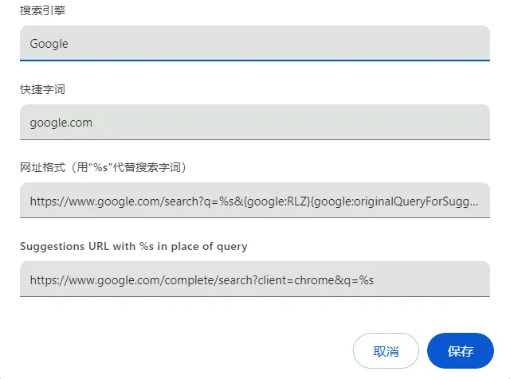

# ungoogled-chromium

## 扩展下载链接

CRX files are downloaded using the following template CRX URL:

```
https://clients2.google.com/service/update2/crx?response=redirect&acceptformat=crx2,crx3&prodversion=[VERSION]&x=id%3D[EXTENSION_ID]%26installsource%3Dondemand%26uc
```

Where:

- `[EXTENSION_ID]` is the extension ID from the Chrome Webstore. This can be retrieved from the Chrome Webstore URL for that extension, which has the form `https://chrome.google.com/webstore/detail/[...]/[EXTENSION_ID]`
- `[VERSION]` is the Chromium browser version.

Example:

`````
https://clients2.google.com/service/update2/crx?response=redirect&acceptformat=crx2,crx3&prodversion=124.0&x=id%3D[EXTENSION_ID]%26installsource%3Dondemand%26uc
`````


### Proxy SwitchyOmega

```
https://clients2.google.com/service/update2/crx?response=redirect&acceptformat=crx2,crx3&prodversion=124.0&x=id%3Dpadekgcemlokbadohgkifijomclgjgif%26installsource%3Dondemand%26uc
```

### 篡改猴

```
https://clients2.google.com/service/update2/crx?response=redirect&acceptformat=crx2,crx3&prodversion=124.0&x=id%3Ddhdgffkkebhmkfjojejmpbldmpobfkfo%26installsource%3Dondemand%26uc
```

### uBlock Origin

```
https://clients2.google.com/service/update2/crx?response=redirect&acceptformat=crx2,crx3&prodversion=124.0&x=id%3Dcjpalhdlnbpafiamejdnhcphjbkeiagm%26installsource%3Dondemand%26uc
```

### Cookie AutoDelete

```
https://clients2.google.com/service/update2/crx?response=redirect&acceptformat=crx2,crx3&prodversion=124.0&x=id%3Dfhcgjolkccmbidfldomjliifgaodjagh%26installsource%3Dondemand%26uc
```

### 沉浸式翻译

`````
https://clients2.google.com/service/update2/crx?response=redirect&acceptformat=crx2,crx3&prodversion=124.0&x=id%3Dbpoadfkcbjbfhfodiogcnhhhpibjhbnh%26installsource%3Dondemand%26uc
`````

### Aria2 Explorer

`````
https://clients2.google.com/service/update2/crx?response=redirect&acceptformat=crx2,crx3&prodversion=124.0&x=id%3Dmpkodccbngfoacfalldjimigbofkhgjn%26installsource%3Dondemand%26uc
`````

### Bitwarden - 免费密码管理器

`````
https://clients2.google.com/service/update2/crx?response=redirect&acceptformat=crx2,crx3&prodversion=124.0&x=id%3Dnngceckbapebfimnlniiiahkandclblb%26installsource%3Dondemand%26uc
`````


## 配置

### chrome://flags
Disable search engine collection 不自动添加搜索引擎

Clear data on exit 退出时清理数据

Remove Tabsearch Button 移除标签页搜索按钮

Disable QR Generator 移除二维码生成选项

Custom New Tab Page 设置新标签页  (空白页为：about:blank)

Parallel downloading 多线程下载

Reduce User-Agent request header 不知道有没有用

| 选项                           | 说明                                                         |
| ------------------------------ | ------------------------------------------------------------ |
| #show-avatar-button            | Disabled 隐藏用户按钮                                        |
| #remove-tabsearch-button       | Enabled 可以隐藏搜索标签页按钮                               |
| #disable-qr-generator          | Enabled 可以隐藏地址栏中的二维码图标                         |
| #disable-sharing-hub           | Enabled 可以隐藏地址栏中的分享图标                           |
| #hide-sidepanel-button         | Enabled 可以隐藏浏览器侧边栏/阅读列表                        |
| #chrome-labs                   | Disabled 去除实验室图标                                      |
| #enable-tab-audio-muting       | Enabled 标签页静音功能                                       |
| #scroll-tabs                   | Enabled 滚轮切换标签                                         |
| #custom-ntp                    | Enabled 修改新标签地址（修改为 `chrome://new-tab-page` 即可修改主题） |
| #smooth-scrolling              | Enabled 平滑滚动                                             |
| #windows-scrolling-personality | Enabled 修复 Windows 下滚动不流畅问题                        |
| #remove-tabsearch-button       | Enabled 去除标签搜索按钮                                     |
| #enable-parallel-downloading   | Enabled 启用多线程下载                                       |
| #chrome-refresh-2023           | Enabled 新的 Chrome UI (需要同时开启)                        |
| #chrome-webui-refresh-2023     | Enabled 新的 Chrome UI (需要同时开启)                        |
| #customize-chrome-side-panel   | Enabled 新的 Chrome UI (需要同时开启)                        |
| #fluent-scrollbars             | Enabled win11 风格的滚动条(需要系统支持)                     |
| #windows11-mica-titlebar       | Enabled Win11 Mica 风格透明标题栏(需要系统支持)              |

#### [其他选项](https://flapypan.top/notes/ungoogled-chromium#其他选项)

**警告：下列选项请根据需要酌情使用！**

| 选项                                  | 说明                                                         |
| ------------------------------------- | ------------------------------------------------------------ |
| #temporary-unexpire                   | Enabled 使所有暂时失效的选项重新可用                         |
| #set-ipv6-probe-false                 | Disabled ipv6 探测                                           |
| #enable-quic                          | Enabled HTTP3 QUIC 协议支持                                  |
| #ignore-gpu-blocklist                 | Enabled 强制开启 GPU 加速                                    |
| #enable-gpu-rasterization             | Enabled GPU 光栅化处理页面                                   |
| #zero-copy-video-capture              | Enabled 零拷贝视频捕获                                       |
| #enable-zero-copy                     | Enabled 零拷贝光栅化                                         |
| #enable-drdc                          | Enabled GPU 合成器使用单独的线程                             |
| #use-angle                            | D3D11 ANGLE 图形后端(N 卡推荐 OpenGL，其他独显 D3D11on12，核显 D3D11) |
| #canvas-oop-rasterization             | Enabled 在 GPU 进程中执行 Canvas 2D 光栅化                   |
| #enable-oop-print-drivers             | Enabled 使与操作系统的打印交互可以在进程外进行               |
| #enable-raw-draw                      | Enabled 启用 Raw Draw                                        |
| #background-resource-fetch            | Enabled 使用 Blink 后台引擎获取资源                          |
| #ui-enable-shared-image-cache-for-gpu | Enabled 共享 GPU 图像解码缓存                                |
| #enable-zstd-content-encoding         | Enabled zstd 压缩格式                                        |
| #enable-shared-zstd                   | Enabled zstd 压缩格式                                        |
| #use-gpu-scheduler-dfs                | Enabled 新的 GPU 调度器                                      |
| #use-client-gmb-interface             | Enabled 使用新的 ClientGmb 接口创建 GPU 缓存                 |

### 启动参数
--user-data-dir  数据存放目录

--user-agent

### [修复在线扩展问题](https://flapypan.top/notes/ungoogled-chromium#修复在线扩展问题)

1. 浏览器打开地址 `chrome://flags/#extension-mime-request-handling`，修改为Always prompt for install；
2. 下载扩展 https://github.com/NeverDecaf/chromium-web-store/releases，将下载好的 `.crx` 文件拖到 `chrome://extensions/` 页面安装；
3. chromium-web-store 可以自动检测插件版本，但无法自动更新插件，需要手动点击需要更新的插件进行安装。


如果 Chrome 的在线商城无法安装扩展，可借用 Edge 的来安装：https://microsoftedge.microsoft.com/addons

- 导入导出

`````
沉浸式翻译 - 网页翻译插件 | PDF翻译 | 免费|bpoadfkcbjbfhfodiogcnhhhpibjhbnh
uBlock Origin|cjpalhdlnbpafiamejdnhcphjbkeiagm
篡改猴|dhdgffkkebhmkfjojejmpbldmpobfkfo
Cookie AutoDelete|fhcgjolkccmbidfldomjliifgaodjagh
Auto History Wipe|jmbmmokoibgcdhnpopjlkdaeoppffpno
Aria2 Explorer|mpkodccbngfoacfalldjimigbofkhgjn
Chromium Web Store|ocaahdebbfolfmndjeplogmgcagdmblk|https://raw.githubusercontent.com/NeverDecaf/chromium-web-store/master/updates.xml
Charset|oenllhgkiiljibhfagbfogdbchhdchml
Proxy SwitchyOmega|padekgcemlokbadohgkifijomclgjgif
FeHelper(前端助手)|pkgccpejnmalmdinmhkkfafefagiiiad
`````


### 保留网站 Cookies

 ungoogled-chromium 在默认情况下，关闭浏览器时会清除所有网站的 Cookie。此举虽然能保护隐私，但是每次打开浏览器的时候都要重新登陆各种网站和服务，在实际使用中颇为不便。建议在`chrome://settings/cookies` 设置中将「常规设置」的选项修改为「在无痕模式下阻止第三方 Cookie」。


### [添加 Google 搜索](https://flapypan.top/notes/ungoogled-chromium#添加-google-搜索)

由于所有的 Google 服务被关闭，Google 搜索需要手动添加

1. 打开 `chrome://settings/searchEngines`；
2. 点击添加网站搜索，按照下方内容填写
3. 搜索引擎：Google
4. 快捷字词：google.com
5. 网址格式：`https://www.google.com/search?q=%s&{google:RLZ}{google:originalQueryForSuggestion}{google:assistedQueryStats}{google:searchFieldtrialParameter}{google:iOSSearchLanguage}{google:prefetchSource}{google:searchClient}{google:sourceId}{google:contextualSearchVersion}ie={inputEncoding}`
6. 推荐地址：`https://www.google.com/complete/search?client=chrome&q=%s`
7. 保存后设置为默认搜索引擎即可


